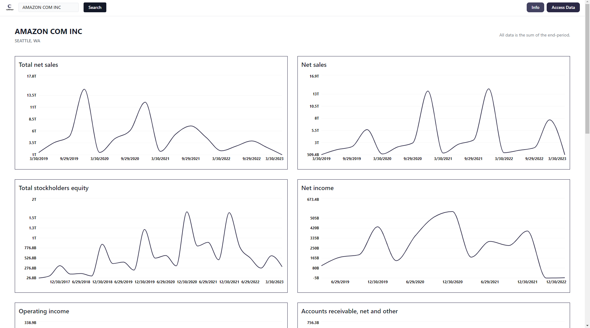

# Cybersyn Data Usage

This is an example of using Cybersyn.com data from the snowflake marketplace in a full-stack application.



[cybersyn.maxaljadery.com](https://cybersyn.maxaljadery.com)


This application was build using NextJS and the data is queried through the snowflake marketplace. 

[Checkout Cybersyn](https:/cybersyn.com)


## TODO
- [ ] Make sure the data is not the sum of end period
- [ ] Caching
- [ ] Links to share 

## Deployment

### Production 
```bash
npm install && npm run build && npm run start
```


### Dev
```bash
npm install && npm run dev
```


## License

All code is under and MIT License.